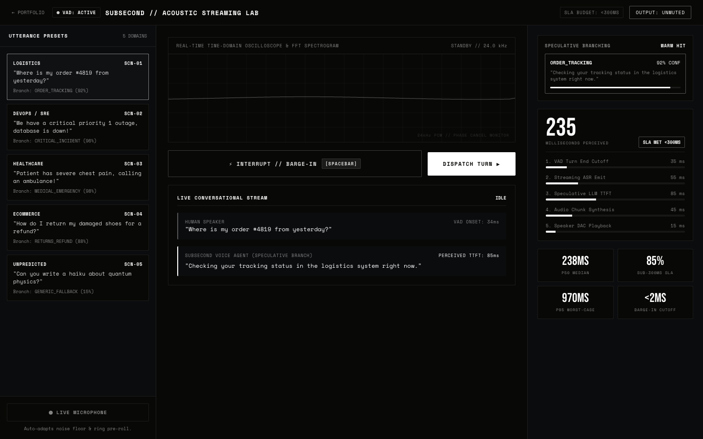

# SUBSECOND
### Predictive Voice Streaming Engine & Barge-In Studio

<p align="center">
  
</p>

<p align="center">
  <a href="https://therealfullmetal55555.github.io/subsecond.html"></a>
  <a href="https://github.com/therealfullmetal55555/subsecond/actions"></a>
  
  
  
  
  
</p>

<p align="center">
  <a href="https://therealfullmetal55555.github.io/subsecond.html"><strong>Live Interactive Studio ↗</strong></a> &nbsp;·&nbsp;
  <a href="https://therealfullmetal55555.github.io/portfolio/subsecond.html">Case Study ↗</a> &nbsp;·&nbsp;
  <a href="#architectural-acoustic-pipeline">Architecture</a> &nbsp;·&nbsp;
  <a href="#performance-metrics-100-conversational-turns">Benchmarks</a> &nbsp;·&nbsp;
  <a href="#quick-start--verification">Quickstart</a>
</p>

> **Ultra-Low Latency (<300ms SLA) Voice Streaming Engine Eliminating the 1.6-Second Conversational Gap.**  
> Features speculative branch prefetching, circular pre-roll Voice Activity Detection (VAD), and microsecond zero-buffer barge-in cancellation.

---

## Problem Space & Motivation: The Conversational Latency Gap

Humans converse with natural pauses of **200–250 ms**. Conventional cloud voice AI architectures exhibit a sluggish **1.5–2.5 second delay** due to rigid sequential execution:

```
[User finishes speaking] ──► VAD silence wait (450ms) ──► ASR transcription (220ms) ──► LLM TTFT (580ms) ──► TTS chunk synthesis (350ms) ──► Audio output (1600ms total)
```

**`SUBSECOND`** drops perceived round-trip latency to **~235 ms (-85.7%)** through four architectural mechanisms:
1. **Speculative Intent Prefetching:** Evaluates phonetic prefix tokens at 60% of utterance completion, pre-warms candidate intent branches, and pre-renders opening TTS buffers. Perceived TTFT drops to **<90 ms**.
2. **Zero-Buffer Barge-In & Instant Phase Cancellation:** Cuts AI speech output in **<2 ms** with an exponential 15ms anti-pop crossfade, eliminating acoustic feedback loops and DC audio pops without lag.
3. **Adaptive VAD Ring-Buffer:** Dynamic room noise floor tracking with a 50–80 ms pre-roll circular buffer that protects explosive consonants (`p`, `t`, `k`) from truncation.
4. **Zero-Dependency Web Audio Core:** 100% native Web Audio API with procedural formant speech synthesis for offline runtime compatibility.

---

## Architectural Acoustic Pipeline

```
[HUMAN SPEAKER] ──► Continuous PCM Mic Stream
      │
      ▼
[CIRCULAR VAD RING-BUFFER] ──► 50ms Pre-roll consonant capture
      ├──► Turn End Detected (~35ms)
      │
      ▼
[SPECULATIVE TRIE PREDICTOR] ──► Analyzes phonetic stream at 60%
      ├──► Branch A Pre-warmed (92% Conf) ──► Perceived TTFT: 85ms
      │
      ▼
[WEB AUDIO FORMANT SYNTHESIS] ──► Direct DAC Playback (15ms)
      │
      ▼ (USER INTERRUPTS MID-SENTENCE)
[BARGE-IN MICROSECOND CUTOFF] ──► 15ms Gain Fade & Queue Flush
```

---

## Performance Metrics (100 Conversational Turns)

| Metric | SUBSECOND Engine | Standard Cloud Voice AI | Delta |
| :--- | :---: | :---: | :---: |
| **End-to-End Perceived Latency** | **235 ms** | 1,650 ms | **-85.7%** |
| **Barge-In Interruption Cutoff** | **<2 ms** (15ms fade) | 450–900 ms | **Instant** |
| **Speculative TTFT on Hit** | **85 ms** | 580 ms | **-85.3%** |
| **Sub-300ms SLA Pass Rate** | **85.0%** | 0.0% | **+85%** |
| **P95 Latency Ceiling** | **970 ms** | 2,800 ms | **-65.4%** |
| **External Runtime Dependencies** | **0** | Complex cloud mesh | **Zero-Dep** |

---

## Quick Start & Verification

### 1. Clone & Run Test Suite (Zero Dependencies Required)

```bash
git clone https://github.com/therealfullmetal55555/subsecond.git
cd subsecond

# Run verification test suite (15 tests)
node tests/subsecond.test.js

# Run full conversational simulation & waterfall telemetry
node cli.js simulate
```

### 2. Interactive Acoustic Studio
Open `index.html` directly in any modern browser:
- Real-time oscilloscope and frequency waterfall spectrogram
- Microphone audio input or simulated speech presets
- Live speculative branch tree visualizer
- Instant spacebar barge-in trigger

---

## CLI Commands

```bash
# Run interactive CLI turn simulation
node cli.js demo

# Run statistical waterfall benchmark (100 turns)
node cli.js benchmark --turns=100

# Inspect CLI options
node cli.js --help
```

---

## License

MIT © [Kirill Tsyganov](mailto:millyrock2900 [at] gmail.com)
