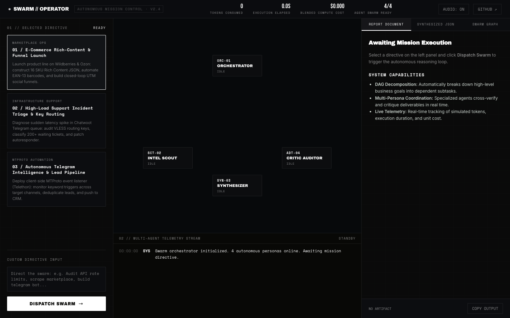

# SWARM // OPERATOR
### Autonomous Multi-Agent Mission Control & Coordination Bus

<p align="center">
  
</p>

<p align="center">
  <a href="https://therealfullmetal55555.github.io/swarm-operator.html"></a>
  <a href="https://github.com/therealfullmetal55555/swarm-operator/actions"></a>
  
  
  
  
</p>

<p align="center">
  <a href="https://therealfullmetal55555.github.io/swarm-operator.html"><strong>Live Interactive Studio ↗</strong></a> &nbsp;·&nbsp;
  <a href="https://therealfullmetal55555.github.io/portfolio/swarm-operator.html">Case Study ↗</a> &nbsp;·&nbsp;
  <a href="#architecture">Architecture</a> &nbsp;·&nbsp;
  <a href="#core-capabilities">Capabilities</a> &nbsp;·&nbsp;
  <a href="#quick-start--verification">Quickstart</a>
</p>

> **Event-Driven Multi-Agent Coordination Engine & Telemetry Bus.**  
> Designed under the "AI-Augmented Operator" paradigm: directing an autonomous workforce of specialized AI agents as a cohesive unit to execute complex, multi-stage business systems with full auditability.

---

## Architecture

```
                       [ USER DIRECTIVE / GOAL ]
                                  │
                                  ▼
                   ┌──────────────────────────────┐
                   │   ORC-01 // ORCHESTRATOR     │
                   │ (DAG Task Decomposition)     │
                   └──────────────┬───────────────┘
                                  │
           ┌──────────────────────┼──────────────────────┐
           ▼                      ▼                      ▼
┌─────────────────────┐┌─────────────────────┐┌─────────────────────┐
│ SCT-02 // SCOUT     ││ SYN-03 // SYNTHESIZE││ ADT-04 // AUDITOR   │
│ Market Intel & APIs ││ Code, Copy & Schemas││ Constraints & SLA   │
└──────────┬──────────┘└──────────┬──────────┘└──────────┬──────────┘
           │                      │                      │
           └──────────────────────┼──────────────────────┘
                                  │
                   ┌──────────────▼──────────────┐
                   │     EVENT-DRIVEN PUB/SUB    │
                   │  (Telemetry, Token Cost,    │
                   │    Episodic Memory Buffer)  │
                   └──────────────┬───────────────┘
                                  ▼
                 [ PRODUCTION DELIVERABLES ARTIFACT ]
```

---

## Core Capabilities

1. **Four Autonomous Agent Personas:**
   - **ORC-01 (Orchestrator):** Dynamically decomposes open-ended directives into dependency-ordered execution steps.
   - **SCT-02 (Intel Scout):** Dispatches research queries, extracts market parameters, and validates baseline assumptions.
   - **SYN-03 (System Synthesizer):** Produces concrete business deliverables (Ozon/WB Rich-Content JSON, Python automation scripts, marketing funnels).
   - **ADT-04 (Critic Auditor):** Verifies outputs against constraints, compliance rules, and SLA latency budgets.

2. **Live Visual Topology & Particle Stream:**
   - Real-time HTML5 Canvas rendering of agent communication states (`IDLE`, `THINKING`, `TOOL_INVOKED`, `DONE`).
   - Dynamic particle routing demonstrating inter-agent message handovers.

3. **Telemetry & Unit Economics:**
   - Live simulated token consumption counter.
   - Real-time elapsed execution stopwatch.
   - Blended LLM compute cost calculator ($0.0006 / 1k tokens benchmark).

4. **Procedural Acoustic Design:**
   - Low-latency synthetic Web Audio API acoustic feedback for state transitions, tool dispatches, and artifact delivery (with toggle).

5. **Zero-Dependency Runtime:**
   - 100% pure vanilla JavaScript + CSS. No Node.js build step required for browser deployment.

---

## Quick Start & Verification

### 1. Run Verification Test Suite

```bash
git clone https://github.com/therealfullmetal55555/swarm-operator.git
cd swarm-operator

# Run 18-point verification test suite
node tests/swarm.test.js
```

### 2. Launch Mission Control Console
Open `index.html` directly in any web browser:
```bash
open index.html
```

---

## Connecting Production LLM Backends

The engine plugs directly into live LLM endpoints (Anthropic Claude, Groq, or OpenAI) by swapping the simulated sleep in `engine/agents.js` with direct HTTP fetch calls to an edge proxy or local backend:

```javascript
// Example: Live Anthropic API dispatch
async function callAgentLLM(systemPrompt, userPrompt) {
  const res = await fetch('https://api.anthropic.com/v1/messages', {
    method: 'POST',
    headers: {
      'x-api-key': process.env.ANTHROPIC_API_KEY,
      'anthropic-version': '2023-06-01',
      'content-type': 'application/json'
    },
    body: JSON.stringify({
      model: 'claude-3-7-sonnet-20250219',
      max_tokens: 1024,
      system: systemPrompt,
      messages: [{ role: 'user', content: userPrompt }]
    })
  });
  return await res.json();
}
```

---

## Author & Contact

**Kirill Tsyganov**  
AI Systems & Automation Engineer  
Telegram: [@therealfullmetal](https://t.me/therealfullmetal) · GitHub: [therealfullmetal55555](https://github.com/therealfullmetal55555) · Email: [millyrock2900 [at] gmail.com](mailto:millyrock2900 [at] gmail.com)

---

## License

MIT © [Kirill Tsyganov](mailto:millyrock2900 [at] gmail.com)
